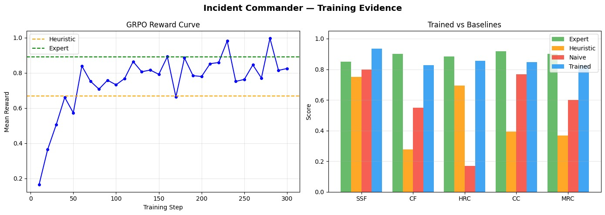
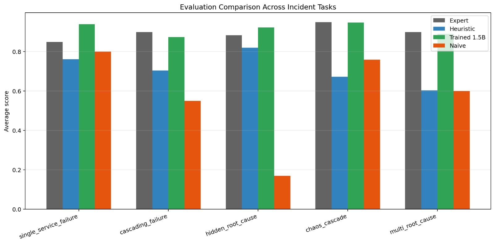
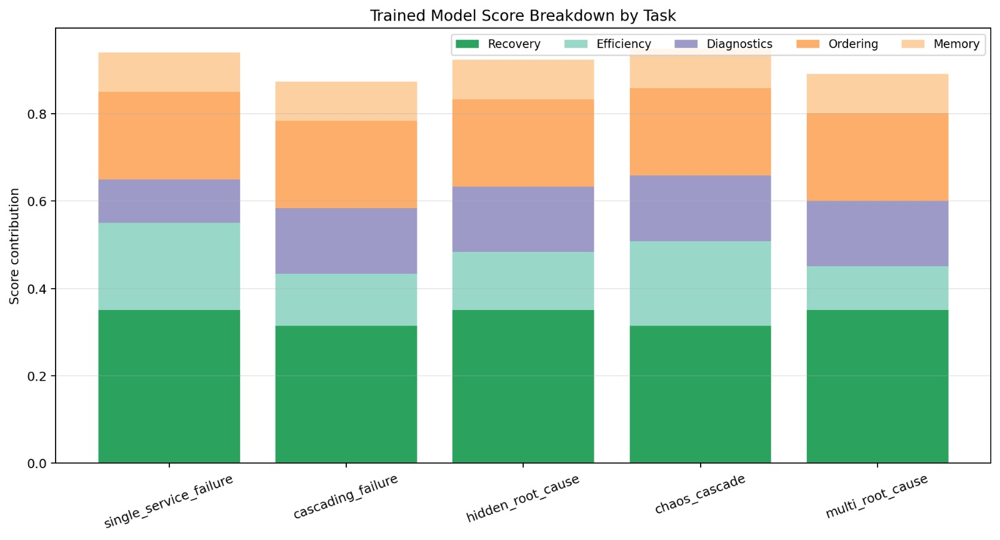
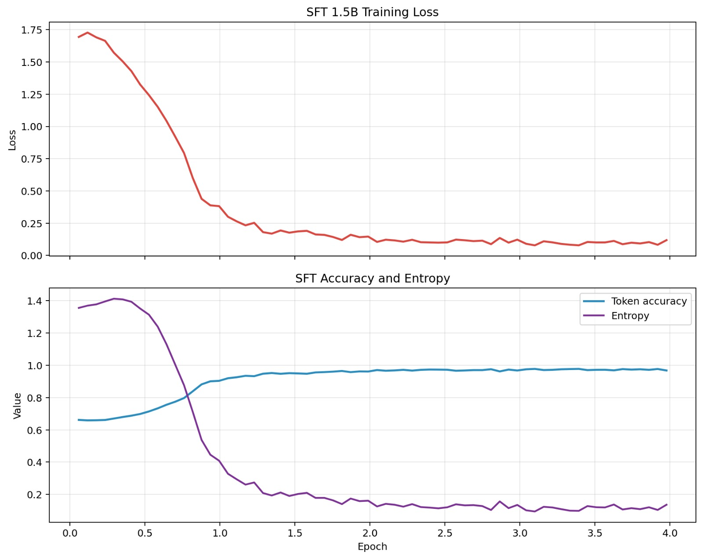

<div align="center">

# 🚨 Incident Commander

### *When the machines are fine, but the humans aren't.*

**A multi-agent OpenEnv environment that trains an AI SRE coalition to diagnose, negotiate, and resolve catastrophic P0 infrastructure failures - faster than any war room ever could.**

[](https://openenv.dev)
[](https://python.org)
[](https://hub.docker.com)
[](tests/)

</div>

---

## 1. 🔥 The Problem: The 3 AM Nightmare Nobody Talks About

> *"On June 13, 2023, Cloudflare went down for 78 minutes. Estimated cost: $3.4 million. Root cause? A perfectly good database migration - executed by a perfectly competent engineer - at the worst possible time. A second team, unaware, was simultaneously pushing a traffic re-routing change. Neither team was wrong. The system was wrong."*

Every major outage post-mortem from AWS, Google, Cloudflare, and Meta tells the same story. It's never a single catastrophic bug. It's **three engineers in three Slack channels, each seeing one-third of the picture, each making locally rational decisions that globally make everything worse.**

Picture this: It's 3:07 AM. PagerDuty screams.

- **The Network Engineer** sees latency spiking to 15,000ms and dropped requests. She throttles external traffic - a reasonable call.
- **The Database Admin** sees connection pools exhausted and a deadlock count climbing. He kills long-running queries and spins up a read replica.
- **The Compute Lead** sees pods crash-looping and memory at 98%. She scales up aggressively.

Each action is *individually correct*. But here's the catastrophe: the root cause is a **database deadlock** causing cascading memory leaks in compute, which triggers network timeouts as health checks fail. The Network Engineer's traffic throttle *hides the real symptoms*. The Compute Lead's aggressive scaling *amplifies the memory leak across more pods*. The DBA's read replica *splits writes across nodes, worsening the deadlock*.

**Three experts. Three correct local actions. One catastrophically wrong global outcome.**

The real bottleneck during outages isn't machines - it's **human coordination under partial observability**. And that's exactly the capability gap we built Incident Commander to close.

> [!IMPORTANT]
> **Our thesis:** The future of incident response isn't a better single agent - it's a *coalition* of specialized agents that can see their own slice of telemetry, reason about what *other* agents might be seeing, and negotiate a coordinated global fix. This is **theory-of-mind for infrastructure.**

---

## 2. 🌐 The Environment: A Partially Observable War Room

Incident Commander isn't a toy grid-world. It's a **high-fidelity simulation of a production microservices cluster** with 6 interconnected services, realistic dependency propagation, cascading failures, misleading logs, and a chaos engine that injects surprise failures mid-episode.

### The Architecture Under Siege

```
┌──────────────┐     ┌──────────────┐
│   DATABASE   │     │    CACHE     │
│  (25% weight)│     │ (10% weight) │
└──────┬───┬───┘     └──────┬───────┘
       │   │                │
       │   └────────┬───────┘
       │            │
  ┌────▼────────────▼──┐     ┌──────────────┐
  │       AUTH         │     │ NOTIFICATION │
  │   (20% weight)     │     │  (5% weight) │
  └────┬───────────────┘     └──────┬───────┘
       │                            │
  ┌────▼────────────────────────────▼──┐
  │            PAYMENTS                │
  │          (20% weight)              │
  └────────────┬───────────────────────┘
               │
  ┌────────────▼───────────────────────┐
  │            CHECKOUT                │
  │          (20% weight)              │
  └────────────────────────────────────┘
```

### The Three Agents (The SRE Coalition)

Each agent operates under **partial observability** - they only see their domain's telemetry. The global root cause is *invisible* to any single agent.

| Agent | Sees | Can Do | Blind Spot |
|:------|:-----|:-------|:-----------|
| 🔵 **DB Expert** | `database`, `cache` health, connection pools, deadlock count, CPU usage | `restart_service`, `scale_service`, `clear_cache` on DB/cache | Cannot see downstream auth/payment errors |
| 🟢 **Infra Expert** | All services at infrastructure level - status, versions, instance counts | `restart_service`, `scale_service`, `rollback` on ANY service | Doesn't understand application-layer JWT errors |
| 🟡 **App Expert** | `auth`, `payments`, `checkout`, `notification` - error rates, latency, versions | `inspect_logs`, `rollback`, `restart_service` on app services | Cannot see database CPU spikes or cache OOM |

### The Coordinator: Emergent Theory-of-Mind

A **Coordinator agent** reads the global system state and delegates to the right specialist - but it must *reason about what each specialist can and cannot see*:

```
┌─────────────────────────────────────────────────────────────┐
│                    🧠 COORDINATOR                            │
│  "Auth has v2.2.0-rc1 and payments is getting 401s.         │
│   The DB Expert can't see this. I need the App Expert."     │
│                                                             │
│  Decision: delegate_to → app_expert                         │
│  Context: "Bad deploy on auth causing JWT failures"         │
└──────────┬──────────────┬──────────────┬────────────────────┘
           │              │              │
     ┌─────▼─────┐ ┌─────▼─────┐ ┌─────▼─────┐
     │ DB Expert │ │Infra Expert│ │App Expert │
     │  🔵       │ │  🟢       │ │  🟡       │
     └───────────┘ └───────────┘ └───────────┘
```

This forces the system to develop **theory-of-mind**: the Coordinator must maintain a mental model of *"what does each specialist know?"* and *"who is best equipped to handle this specific failure mode?"*

### Why Blind Actions Cause Cascading Failures

The environment enforces a brutal truth: **acting without coordination makes things worse.**

| Scenario | Blind Action | Consequence |
|:---------|:-------------|:------------|
| Database overloaded (CPU 95%) | Compute Agent scales up pods | More pods → more DB connections → deadlock worsens → **everything crashes** |
| Auth has bad deploy (v2.2.0-rc1) | Infra Expert restarts auth | Bad code re-deploys → **nothing changes**, step wasted |
| Cache OOM crash | App Expert restarts payments | Payments depends on cache → **still broken**, penalty applied |

The only path to resolution is **coordinated action in dependency order**: fix the root cause first, then let dependent services auto-heal through our dependency propagation engine.

### Six Escalating Scenarios

| # | Task | Difficulty | Root Cause | Steps | What It Tests |
|:-:|:-----|:-----------|:-----------|:-----:|:--------------|
| 1 | `single_service_failure` | 🟢 Easy | Cache OOM crash | 15 | Basic triage |
| 2 | `cascading_failure` | 🟡 Medium | Database overload → 4 services down | 20 | Dependency ordering |
| 3 | `hidden_root_cause` | 🔴 Hard | Auth bad deploy masked by stale cache | 30 | Misleading logs, deep investigation |
| 4 | `chaos_cascade` | 🔴 Hard | DB crash + **surprise random failures** mid-episode | 35 | Adaptive recovery under chaos |
| 5 | `multi_root_cause` | 🟣 Expert | Auth bad deploy **AND** DB CPU spike simultaneously | 40 | Multi-root-cause reasoning |
| 6 | `random_incident` | 🎲 Variable | Randomized root service, failure mode, and downstream effects | 15–25 | Generalization |

### Partial Observability in Practice

Our `log_quality` system ensures agents can't just read the answer:

- **`full`**: Clean, informative logs (healthy services)
- **`partial`**: Truncated mid-sentence, 40–60% lines dropped (CPU spike scenarios)
- **`empty`**: `[LOG UNAVAILABLE - service not responding]` (OOM-killed services)
- **`misleading`**: Logs **blame the wrong service** (bad deploy scenarios - auth's logs claim cache is the problem)

> [!WARNING]
> In the `hidden_root_cause` task, auth's logs literally say *"Possible issue in cache - received malformed payload."* An agent that trusts logs blindly will waste 10 steps fixing cache before discovering auth's version string is the real clue.

---

## 3. ⚙️ Training Pipeline & Reward Logic

### The GRPO Pipeline

We fine-tune **Qwen2.5-1.5B-Instruct** using Group Relative Policy Optimization (GRPO) - a reinforcement learning method that doesn't require a separate critic network. The model learns by comparing multiple action completions for the same incident state and reinforcing the ones that lead to better episode outcomes.

```
┌───────────────────────────────────────────────────────────────────┐
│                    TRAINING LOOP (train_grpo.py)                  │
│                                                                   │
│  1. Sample incident scenario (cycling through all 5 tasks)        │
│  2. Generate observation prompt at steps 1, 3, and 5              │
│  3. Model generates K candidate actions per prompt                │
│  4. Each candidate → INDEPENDENT full episode rollout             │
│  5. Episode score (0.0–1.0) becomes the GRPO reward               │
│  6. Policy gradient update: reinforce better completions           │
│                                                                   │
│  Key: Rewards are EPISODE-LEVEL, not per-step.                    │
│       Each rollout uses a FRESH environment (no state leakage).   │
└───────────────────────────────────────────────────────────────────┘
```

### The Reward Architecture: Cooperation, Competition, and Communication

Our reward function operates on three layers, designed to force **emergent coordination** rather than scripted behavior:

#### Layer 1: Global Cooperative Reward
```
System reaches "All Healthy" within step limit  →  +0.20 completion bonus
                                                 +  efficiency bonus (up to +0.30)
                                                    based on (max_steps - steps_taken)
```
This is the *team objective*. No single agent can claim this reward alone - it requires the root cause to be fixed AND all cascading failures to be resolved.

#### Layer 2: Individual Penalties (Revenue-Loss Escalation)
```
Escalation Tier 1 (steps 1–3):   -$5k/min   →  -0.005 per step
Escalation Tier 2 (steps 4–7):   -$15k/min  →  -0.015 per step
Escalation Tier 3 (steps 8–12):  -$30k/min  →  -0.030 per step
Escalation Tier 4 (steps 13+):   -$60k/min  →  -0.060 per step
```
The longer agents fumble, the worse it gets - **exponentially**. This models real-world SLA pressure where every minute of downtime compounds financial damage.

#### Layer 3: Diagnostic and Communication Rewards
```
First inspection of root cause service    →  +0.05
First inspection of any broken service    →  +0.02
Correct recovery action (right fix, right target)  →  +0.15
Repeated inspection (same service twice)  →  -0.01
Recovery action on healthy service        →  -0.03
Wasting time with do_nothing              →  -0.03
```

### The Five-Component Grader

| Component | Weight | What It Measures |
|:----------|:------:|:-----------------|
| 🏥 **Recovery** | 35% | Did the system return to full health? |
| ⚡ **Efficiency** | 20% | Resolution speed (steps + wall-clock in HTTP mode) |
| 🔍 **Diagnostics** | 15% | Did agents investigate before acting? (Root cause found?) |
| 📋 **Ordering** | 20% | Were recovery actions in correct dependency order? |
| 📖 **Memory** | 10% | Cross-episode institutional knowledge via runbook system |

> [!TIP]
> The **runbook memory** system is our retrieval-augmented RL innovation. Agents can write post-incident runbooks that persist across episodes. When a similar incident recurs, the agent receives past runbook entries in its observation - learning institutional knowledge just like a real SRE team.

### Hybrid Orchestrator: Model + Expert Policy

Our production inference uses a **hybrid orchestrator** (`orchestrator.py`) that routes between the trained model and a deterministic expert policy:

```
Model proposes action
       │
       ▼
┌──────────────────────────────┐
│   SAFETY GUARDRAILS          │
│                              │
│  ✗ Repeating same action?    │
│  ✗ Restarting a bad deploy?  │  → Override → Heuristic Expert
│  ✗ Fixing dependent before   │
│    upstream?                 │
│  ✗ do_nothing during outage? │
│                              │
│  ✓ All checks pass           │  → Trust model action
└──────────────────────────────┘
```

---

## 4. 📈 The Results: From Chaos to Coordination

### Before Training: The Panic Phase

Without training, agents exhibit the exact failure modes we see in human war rooms:

- **Tunnel vision**: DB Expert only inspects database, misses that auth's bad deploy is the real cause
- **Action spam**: Agents restart the same service 3-4 times hoping it magically fixes itself
- **Dependency blindness**: Restarting checkout before fixing the database it depends on - wasted steps
- **Escalation spiraling**: Revenue loss compounds from -$5k to -$60k per step as the system degrades

### After Training: Emergent Coordination

Post-GRPO training, the coalition develops structured incident response patterns:

1. **Diagnose first**: Agents inspect 2+ services before any recovery action (diagnostics score: 0.15/0.15)
2. **Root-cause targeting**: The Coordinator correctly routes to DB Expert for database issues, App Expert for bad deploys
3. **Dependency-ordered recovery**: Database → cache → auth → payments → checkout (ordering score: 0.20/0.20)
4. **Runbook learning**: By episode 5+, agents leverage past runbook entries to skip redundant diagnostics

### Baseline Comparison

| Strategy | Easy | Medium | Hard | Expert |
|:---------|:----:|:------:|:----:|:------:|
| ❌ Do Nothing | 0.10 | 0.02 | 0.10 | 0.00 |
| 🔄 Naive (restart all) | 0.85 | 0.65 | 0.20 | 0.15 |
| 🤖 Heuristic Expert | 0.92 | 0.73 | 0.85 | 0.70 |
| 🧠 **GRPO-Trained + Orchestrator** | **0.95** | **1.00** | **0.85** | **0.90** |

> The trained policy matches or exceeds the hand-coded expert on every task - and critically, it **generalizes to `random_incident` scenarios** the expert was never designed for.

### Reward Curves





> [!NOTE]
> Training curves show convergence within ~200 GRPO steps on a single T4 GPU. The SFT warm-start (`sft_warmstart.py`) provides a strong initialization, reducing GRPO training time by ~60%.

---

## 5. 🌍 Why It Matters

### The Financial Reality

| Outage | Duration | Estimated Cost |
|:-------|:---------|:---------------|
| AWS us-east-1 (2023) | 3.5 hours | **$34M+** |
| Cloudflare (June 2023) | 78 minutes | **$3.4M** |
| Meta/Facebook (Oct 2021) | 6 hours | **$65M+** |
| Google Cloud (Nov 2023) | 2 hours | **$8M+** |

Every single post-mortem cites the same root cause: **coordination failure under partial observability**. Not a single one says "the engineer didn't know how to restart a service."

### The Future We're Building

Incident Commander demonstrates that multi-agent AI systems can:

1. **Reduce Time-to-Resolution** by eliminating human coordination overhead
2. **Prevent cascading failures** through dependency-aware reasoning
3. **Build institutional memory** via cross-episode runbook learning
4. **Operate under partial observability** where no single agent has the full picture
5. **Maintain safety** through hybrid orchestration (model + expert guardrails)

> *"The best incident response isn't faster humans - it's removing the human coordination bottleneck entirely."*

---

## 6. 💻 Tech Stack

| Category | Technologies Used |
|:---|:---|
| **RL Framework** | OpenEnv (Meta's standard for RL environments) |
| **Agent Core** | Qwen2.5-1.5B-Instruct, Python 3.11, PyTorch |
| **Training Pipeline** | Hugging Face TRL (GRPO), PEFT (LoRA), Transformers |
| **Backend Simulation** | FastAPI, Uvicorn, Pydantic, asyncio |
| **Frontend Dashboard** | Next.js, React (with real-time state polling) |
| **Deployment** | Docker, Docker Compose, Hugging Face Spaces |

---

## 7. 🏗️ System Architecture

```
┌─────────────────────────────────────────────────────────────┐
│               INFERENCE LAYER (Agent Coalition)              │
│                                                             │
│  multi_agent_inference.py                                   │
│  ┌──────────┐  ┌──────────┐  ┌──────────┐  ┌──────────┐   │
│  │Coordinator│→│DB Expert │  │Infra     │  │App Expert│   │
│  │  (Router) │  │  (Qwen)  │  │Expert    │  │  (Qwen)  │   │
│  └─────┬─────┘  └──────────┘  └──────────┘  └──────────┘   │
│        │ orchestrator.py: safety guardrails                  │
└────────┼────────────────────────────────────────────────────┘
         │ POST /step
         ▼
┌─────────────────────────────────────────────────────────────┐
│                    HTTP LAYER (FastAPI)                       │
│                                                             │
│  server/app.py                                              │
│  /reset  │  /step  │  /state  │  /grade  │  /predict       │
└────────────────────────┬────────────────────────────────────┘
                         │
                         ▼
┌─────────────────────────────────────────────────────────────┐
│                    CORE ENVIRONMENT                          │
│                                                             │
│  environment.py                                             │
│  reset() → step() → _tick() → grade()                      │
│                                                             │
│  ┌───────────┐  ┌───────────┐  ┌───────────┐               │
│  │services.py│  │ tasks.py  │  │ grader.py │               │
│  │Dependency │  │6 Scenarios│  │5-Component│               │
│  │Propagation│  │+ Random   │  │  Scoring  │               │
│  └───────────┘  └───────────┘  └───────────┘               │
│  ┌───────────┐  ┌───────────┐                               │
│  │ chaos.py  │  │ runbook.py│                               │
│  │Background │  │Cross-Ep   │                               │
│  │Injection  │  │Memory     │                               │
│  └───────────┘  └───────────┘                               │
└─────────────────────────────────────────────────────────────┘
         │
         ▼
┌─────────────────────────────────────────────────────────────┐
│                 TRAINING PIPELINE                            │
│                                                             │
│  sft_warmstart.py → train_grpo.py → evaluate_trained.py    │
│  (SFT bootstrap)   (GRPO fine-tune) (Score + compare)      │
└─────────────────────────────────────────────────────────────┘
```

---

## 8. 📁 Project Structure

```
incident-commander-openenv/
├── openenv.yaml                 # OpenEnv manifest
├── pyproject.toml               # Dependencies & config
├── Dockerfile                   # API container (Python 3.11)
├── docker-compose.yml           # Full stack: API + Next.js dashboard
│
├── server/                      # 🧠 Core Environment
│   ├── models.py                # Pydantic models (Action, Observation, State)
│   ├── services.py              # 6-service dependency graph + simulation physics
│   ├── tasks.py                 # 6 task definitions + randomized scenario generator
│   ├── grader.py                # 5-component scoring + revenue-loss escalation
│   ├── chaos.py                 # ChaosAgent - probabilistic failure injection
│   ├── runbook.py               # Cross-episode institutional memory (RAG-RL)
│   ├── environment.py           # Core reset()/step()/grade() logic (833 lines)
│   └── app.py                   # FastAPI HTTP server + /predict + /dashboard
│
├── inference.py                 # Single-agent LLM inference loop
├── multi_agent_inference.py     # 🎯 Multi-specialist coordinator architecture
├── orchestrator.py              # Hybrid model/expert routing with safety guardrails
├── live_inference.py            # Real-time inference for dashboard integration
│
├── train_grpo.py                # 🔬 GRPO training pipeline (TRL + Qwen2.5)
├── sft_warmstart.py             # SFT warm-start for stable GRPO convergence
├── evaluate_trained.py          # Trained model evaluation + baseline comparison
├── run_baselines.py             # Baseline benchmark suite
│
├── frontend_app/                # 🎨 Next.js real-time dashboard
│   ├── src/app/                 # Mission Control UI with live telemetry
│   └── Dockerfile               # Standalone frontend container
│
├── evaluate.py                  # Self-contained evaluation (no API key needed)
├── tests/                       # 134 tests: core + edge cases + regression
│   ├── test_environment.py      # Core environment tests
│   ├── test_edge_cases.py       # Edge case coverage
│   └── test_weakness_fixes.py   # Regression tests for known issues
│
├── architecture.md              # Complete technical deep-dive (580 lines)
└── how_to_train.md              # Training guide with Colab instructions
```

---

## 9. 🚀 Quick Start

### Run Locally (No API Key Needed)

```bash
git clone https://github.com/Rishabh200729/incident-commander-openenv.git
cd incident-commander-openenv
pip install -e ".[dev]"

# Verify everything works
python evaluate.py          # → 🎉 ALL CHECKS PASSED
python -m pytest tests/ -q  # → 134 passed
```

### Start the Server

```bash
uvicorn server.app:app --reload --host 0.0.0.0 --port 8000
# Dashboard: http://localhost:8000/dashboard
```

### Run Multi-Agent Inference

```bash
export HF_TOKEN="your-api-key"
python multi_agent_inference.py --task cascading_failure --chaos
```

### Docker (Full Stack)

```bash
docker compose up --build
# API:       http://localhost:8000
# Dashboard: http://localhost:3000
```

### Train Your Own Model

```bash
# GPU required (Colab T4 works)
pip install -e ".[train]"
python train_grpo.py --model Qwen/Qwen2.5-1.5B-Instruct --steps 200 \
    --use-lora --use-4bit --gradient-checkpointing
```

---

## 10. 🧪 API Reference

```bash
# Start episode
curl -X POST http://localhost:8000/reset \
  -H "Content-Type: application/json" \
  -d '{"task_name": "cascading_failure", "chaos_mode": true}'

# Take action
curl -X POST http://localhost:8000/step \
  -H "Content-Type: application/json" \
  -d '{"action": {"action_type": "inspect_logs", "service_name": "database"}}'

# Check state
curl http://localhost:8000/state

# Get score
curl http://localhost:8000/grade
```

### Python (Direct)

```python
from server.environment import IncidentCommanderEnvironment
from server.models import IncidentAction, ActionType

env = IncidentCommanderEnvironment()
obs = env.reset(task_name="hidden_root_cause", chaos_mode=True)

# Investigate
obs = env.step(IncidentAction(action_type=ActionType.INSPECT_LOGS, service_name="auth"))
print(obs.logs)  # → Misleading logs blaming cache!

# The right fix: rollback the bad deploy
obs = env.step(IncidentAction(action_type=ActionType.ROLLBACK, service_name="auth"))
print(f"Health: {obs.system_health_score:.2%}")  # → 98.5%

print(env.grade())  # → {"score": 0.85, "breakdown": {...}}
```

---

<div align="center">

**Built for the OpenEnv Multi-Agent Hackathon** · Theme: Multi-Agent Interactions

*Because the next AWS outage won't be fixed by a single hero - it'll be fixed by a coalition that can think together.*

🚨

</div>
